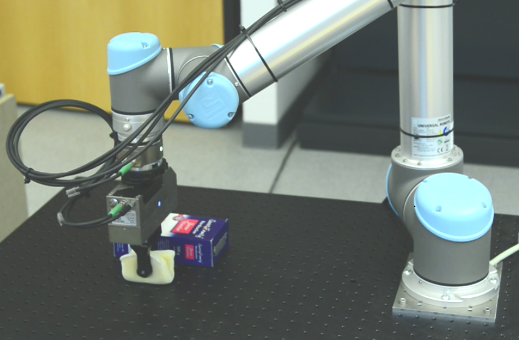
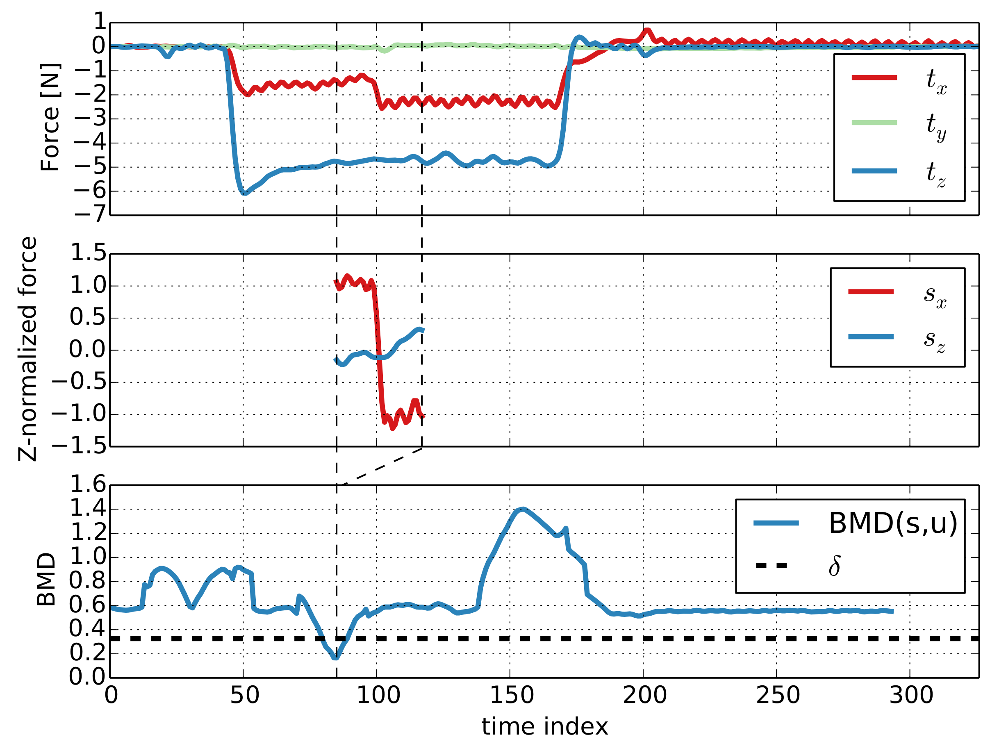

# iai_shapelets
This branch of ```iai_shapelets``` contains the evaluation source code and dataset from the paper "Multidimensional Time Series Shapelets Reliably Detect and Classify Contact Events in Force Measurements of Wiping Actions", currently under review at Robotics and Automation Letters (RA-L). 

We will release both the source code and the dataset as soon as publication has been confirmed.

## Requirements
* python 2.7.3
* scipy
* scikit-learn

## How to run
```python2.7 find_shapelets.py```
For 10 fold cross validation, or
```python2.7 find_shapelets.py --mode=all```
to use the whole dataset

## Dataset Description
```t,x,y,z``` are time series containing the point in time of the measurement and the x,y,z axes of the force readings respectively.
```label``` contains a list of events and ```time_stamps``` contains a list of time points for each event.

## Short Overview

The following robotic setup was used to generate 460 recodings. 
During the wiping executions different events have occured, for example a contact with a movable box.

<br>

<br>



The proposed algorithm learns short shape snippets called shapelets for each event. 
Shapelets can be used to detect events online.
In the following picture you can see how the shapelet for movable box is used to compute a distance time series.
An event has been detected, if the distance gets below the learned threshold for that shapelet.

